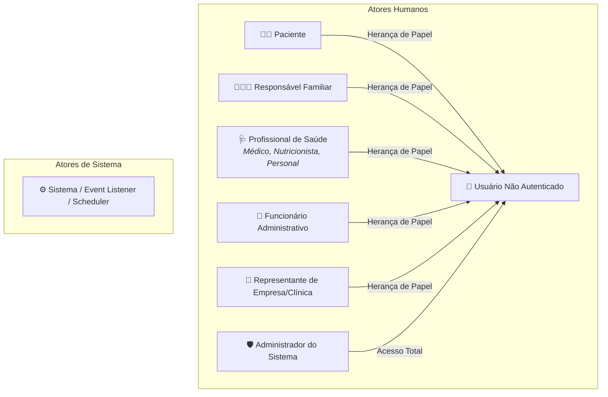
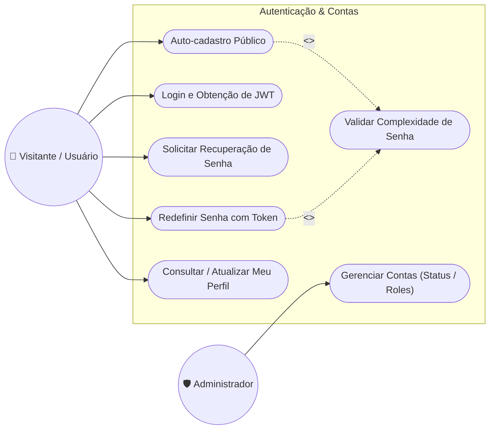
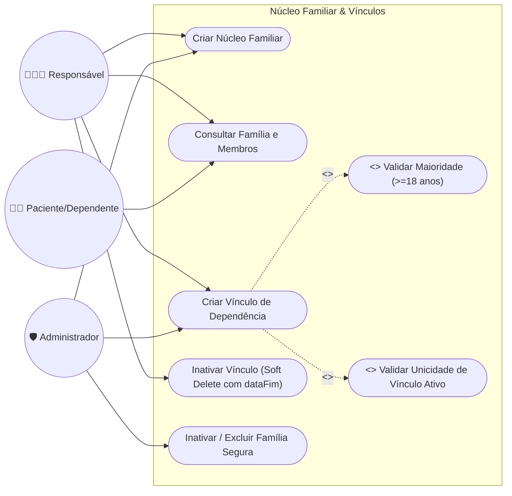
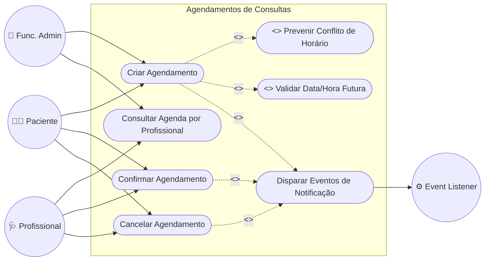
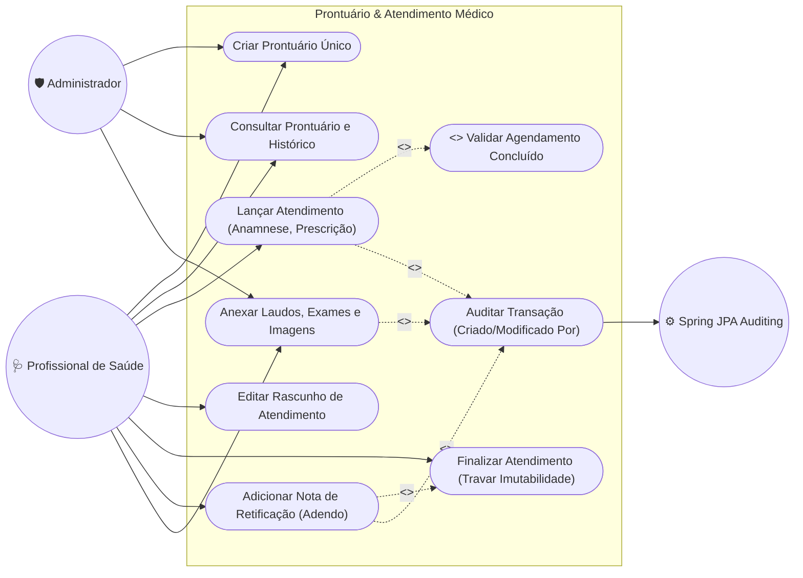

# Diagrama de Casos de Uso - VidaPlena API Backend

Este documento descreve as funcionalidades, atores, limites de sistema e interações da plataforma **VidaPlena API**, formalizados através de Diagramas de Casos de Uso UML e especificações de fluxos de negócio.

---

## 1. Atores do Sistema

Os atores que interagem com a plataforma são categorizados conforme os papéis de acesso do sistema (`TipoUsuario`) e entidades automáticas:

---

## 2. Diagramas Detalhados por Módulo

### 2.1. Módulo de Autenticação e Gestão de Usuários

### 2.2. Módulo de Núcleo Familiar e Dependência

### 2.3. Módulo de Agendamentos Clínicos

### 2.4. Módulo de Prontuário Eletrônico e Evolução Clínica

---

## 3. Especificação dos Principais Casos de Uso

### UC13: Criar Agendamento Clínico
* **Atores:** Paciente, Responsável, Funcionário Administrativo, Administrador.
* **Pré-condições:** Usuário autenticado via JWT; Paciente e Profissional cadastrados no sistema.
* **Fluxo Principal:**
  1. O ator envia os dados do agendamento (`pacienteId`, `profissionalId`, `clinicaId`, `dataHora`, `tipoAtendimento`, `observacoes`).
  2. O sistema valida se a data/hora solicitada é estritamente futura.
  3. O sistema valida a existência do paciente, profissional e clínica.
  4. O sistema verifica se já existe outro agendamento ativo (não cancelado) para aquele profissional no mesmo horário.
  5. O sistema persiste o agendamento com status `AGENDADO`.
  6. O sistema emite o evento síncrono/assíncrono `AgendamentoCriadoEvent`.
  7. O sistema retorna o DTO de agendamento com HTTP 201 Created.
* **Fluxos de Exceção:**
  * *Data no passado:* Retorna HTTP 400 (Bad Request).
  * *Choque de horário:* Retorna HTTP 422 (`ConflitoHorarioException`).
  * *Entidade não encontrada:* Retorna HTTP 422/404 (`RegraNegocioException`).

---

### UC20: Lançar Registro de Atendimento Clínico
* **Atores:** Profissional de Saúde (Médico, Nutricionista, Personal Trainer) ou Administrador.
* **Pré-condições:** Prontuário aberto; Agendamento prévio com status `CONCLUIDO`.
* **Fluxo Principal:**
  1. O profissional preenche sintomas, hipótese diagnóstica, prescrição médica/enfermagem e notas clínicas.
  2. O sistema valida se o agendamento associado está com status `CONCLUIDO` e pertence ao paciente do prontuário.
  3. O sistema valida que não há registro de atendimento duplicado para o mesmo agendamento.
  4. O sistema grava o registro e preenche metadados de auditoria (`criadoPor` com o login do profissional, `dataCriacao`).
  5. O sistema retorna o registro criado com status HTTP 201 Created.

---

### UC21 & UC22: Finalização de Atendimento e Retificação Imutável
* **Atores:** Profissional de Saúde.
* **Regra de Imutabilidade Jurídica:**
  * Enquanto `finalizado = false`, o profissional pode editar os dados do atendimento livremente (rascunho).
  * Uma vez que `finalizado = true`, o registro torna-se **completamente imutável**. Tentativas de `PUT` ou `DELETE` resultam em HTTP 422 (`RegistroImutavelException`).
  * Qualquer alteração posterior exige o caso de uso **UC22 (Adicionar Nota de Retificação)**, que anexa um adendo datado e assinado digitalmente pelo profissional, preservando a integridade histórica original do prontuário (Conformidade CFM / LGPD).

---

### UC23: Anexar Documentos e Imagens ao Prontuário
* **Atores:** Profissional de Saúde (Médico, Nutricionista, Personal Trainer), Administrador.
* **Pré-condições:** Prontuário existente; Arquivo em formato permitido (PDF, PNG, JPG, WEBP, DICOM, etc.) com até 25MB.
* **Fluxo Principal:**
  1. O profissional seleciona o prontuário do paciente e anexa o arquivo (laudo, exame laboratorial, raio-x, tomografia, receita ou relatório).
  2. O profissional informa título descritivo, categoria (`TipoDocumento`), observações clínicas e data do exame.
  3. O sistema valida o tipo MIME e sanitiza o nome do arquivo prevenindo *path traversal*.
  4. O sistema armazena o binário em local seguro e grava o registro na entidade `DocumentoProntuario`.
  5. O sistema retorna os metadados do documento e URL de download/visualização com HTTP 201 Created.

---

## 4. Matriz de Rastreabilidade RBAC (Casos de Uso vs Papéis)

| Caso de Uso | PACIENTE | RESPONSAVEL | PROFISSIONAL (Méd/Nutri/Personal) | FUNC_ADMIN | REP_EMPRESA | ADMINISTRADOR |
| :--- | :---: | :---: | :---: | :---: | :---: | :---: |
| **UC01: Auto-cadastro** | 🟢 (Público) | 🟢 (Público) | 🟢 (Público) | 🟢 (Público) | 🟢 (Público) | 🟢 (Público) |
| **UC02: Login / Auth** | 🟢 | 🟢 | 🟢 | 🟢 | 🟢 | 🟢 |
| **UC04: Meu Perfil** | 🟢 | 🟢 | 🟢 | 🟢 | 🟢 | 🟢 |
| **UC05: Admin Usuários** | 🔴 | 🔴 | 🔴 | 🔴 | 🔴 | 🟢 |
| **UC06: Criar Família** | 🔴 | 🟢 | 🔴 | 🔴 | 🔴 | 🟢 |
| **UC07: Ver Família** | 🟢 (Se membro) | 🟢 (Se membro) | 🟢 | 🟢 | 🔴 | 🟢 |
| **UC08: Vínculo Dependência**| 🔴 | 🟢 | 🔴 | 🔴 | 🔴 | 🟢 |
| **UC10: Gestão Clínicas** | 🔴 | 🔴 | 🔴 | 🔴 | 🟢 (Própria) | 🟢 |
| **UC11: Gestão Empresas** | 🔴 | 🔴 | 🔴 | 🔴 | 🟢 (Própria) | 🟢 |
| **UC13: Criar Agendamento**| 🟢 | 🟢 | 🟢 | 🟢 | 🔴 | 🟢 |
| **UC14: Consultar Agenda** | 🟢 | 🟢 | 🟢 | 🟢 | 🔴 | 🟢 |
| **UC15/16: Confirmar/Canc**| 🟢 | 🟢 | 🟢 | 🟢 | 🔴 | 🟢 |
| **UC18: Abrir Prontuário** | 🔴 | 🔴 | 🟢 | 🔴 | 🔴 | 🟢 |
| **UC19: Histórico Clínico**| 🔴 | 🔴 | 🟢 | 🔴 | 🔴 | 🟢 |
| **UC20: Lançar Atendimento**| 🔴 | 🔴 | 🟢 | 🔴 | 🔴 | 🟢 |
| **UC22: Retificar Prontuário**| 🔴 | 🔴 | 🟢 | 🔴 | 🔴 | 🟢 |
| **UC23: Anexar Documentos**| 🔴 (Leitura 🟢) | 🔴 (Leitura 🟢) | 🟢 | 🔴 | 🔴 | 🟢 |

*Legenda: 🟢 Permitido | 🔴 Acesso Negado (HTTP 403 Forbidden)*
