# 📐 Diagrama de Classes - VidaPlena API Backend

Este documento apresenta a modelagem orientada a objetos e a estrutura relacional do domínio da **VidaPlena API**, estruturada conforme os princípios de **Clean Architecture** e **Domain-Driven Design (DDD)**.

---

## 1. Visão Geral da Arquitetura de Domínio

O modelo de domínio do VidaPlena é dividido em 4 subsistemas principais:
1. **Identidade, Acesso & Auditoria (Core/Infra)**: Gestão de usuários, papéis (RBAC), tokens de recuperação e auditoria transversal (`EntidadeAuditavel`).
2. **Organizações & Vínculos Corporativos**: Estrutura abstrata de organizações especializada em clínicas credenciadas e empresas parceiras.
3. **Núcleo Familiar & Vínculos de Dependência**: Gestão de grupos familiares e tutelas/dependências (idoso, criança, necessidades especiais) com regras de maioridade legal.
4. **Prontuário Eletrônico & Gestão Clínica (Health Domain)**: Pacientes, profissionais de saúde, agendamentos com controle de concorrência e o prontuário eletrônico auditável com imutabilidade e notas de retificação.

---

## 2. Diagrama de Classes UML Completo (Mermaid)

```mermaid
classDiagram
    direction TB

    %% ==========================================
    %% SUPERCLASSES E AUDITORIA
    %% ==========================================
    class EntidadeAuditavel {
        <<abstract / MappedSuperclass>>
        -String criadoPor
        -LocalDateTime dataCriacao
        -String modificadoPor
        -LocalDateTime dataModificacao
        +getCriadoPor() String
        +setCriadoPor(String) void
        +getDataCriacao() LocalDateTime
        +setDataCriacao(LocalDateTime) void
        +getModificadoPor() String
        +setModificadoPor(String) void
        +getDataModificacao() LocalDateTime
        +setDataModificacao(LocalDateTime) void
    }

    %% ==========================================
    %% IDENTIDADE E ACESSO
    %% ==========================================
    class Usuario {
        -UUID id
        -String nome
        -String cpf
        -String email
        -String senha
        -String telefone
        -LocalDate dataNascimento
        -StatusUsuario status
        -Set~TipoUsuario~ tipos
        -Empresa empresa
        -Clinica clinica
        +atualizarSenha(String) void
        +atualizarDadosBasicos(String, String, String, String, LocalDate) void
        +atualizarStatus(StatusUsuario) void
        +substituirTipos(Set~TipoUsuario~) void
        +possuiTipo(TipoUsuario) boolean
    }

    class PasswordResetToken {
        -UUID id
        -String token
        -Usuario usuario
        -LocalDateTime dataExpiracao
        +isExpirado() boolean
    }

    class StatusUsuario {
        <<enumeration>>
        ATIVO
        INATIVO
        BLOQUEADO
        PENDENTE_VALIDACAO
    }

    class TipoUsuario {
        <<enumeration>>
        ADMINISTRADOR
        PACIENTE
        RESPONSAVEL
        MEDICO
        NUTRICIONISTA
        PERSONAL_TRAINER
        FUNCIONARIO_ADMINISTRATIVO
        CUIDADOR
        REPRESENTANTE_EMPRESA
    }

    %% ==========================================
    %% ORGANIZAÇÕES
    %% ==========================================
    class Organizacao {
        <<abstract / Table-Per-Class>>
        -UUID id
        -String nome
        -String cnpj
        +getId() UUID
        +getNome() String
        +getCnpj() String
    }

    class Clinica {
        -String tipo
        +getTipo() String
        +setTipo(String) void
    }

    class Empresa {
        -String setor
        +getSetor() String
        +setSetor(String) void
    }

    %% ==========================================
    %% FAMÍLIA E DEPENDÊNCIA
    %% ==========================================
    class Familia {
        -UUID id
        -String nome
        -List~Usuario~ membros
        +getId() UUID
        +getNome() String
        +getMembros() List~Usuario~
    }

    class VinculoDependencia {
        -UUID id
        -TipoDependencia tipo
        -LocalDate dataInicio
        -LocalDate dataFim
        -Usuario responsavel
        -Usuario dependente
        +getId() UUID
        +getTipo() TipoDependencia
        +getDataInicio() LocalDate
        +getDataFim() LocalDate
        +getResponsavel() Usuario
        +getDependente() Usuario
    }

    class TipoDependencia {
        <<enumeration>>
        CRIANCA
        IDOSO
        NECESSIDADE_ESPECIAL
    }

    %% ==========================================
    %% SAÚDE & GESTÃO CLÍNICA
    %% ==========================================
    class Paciente {
        -UUID id
        -Usuario usuario
        -TipoSanguineo tipoSanguineo
        -List~String~ alergias
        -List~String~ medicamentosContinuos
        -String historicoFamiliar
        +getId() UUID
        +getUsuario() Usuario
        +getTipoSanguineo() TipoSanguineo
        +getAlergias() List~String~
        +getMedicamentosContinuos() List~String~
        +getHistoricoFamiliar() String
    }

    class Profissional {
        -UUID id
        -Usuario usuario
        -String registroConselho
        -Especialidade especialidade
        -UUID clinicaId
        +getId() UUID
        +getUsuario() Usuario
        +getRegistroConselho() String
        +getEspecialidade() Especialidade
        +getClinicaId() UUID
    }

    class Especialidade {
        <<enumeration>>
        CLINICO_GERAL
        CARDIOLOGIA
        DERMATOLOGIA
        GINECOLOGIA
        PEDIATRIA
        PSICOLOGIA
        NUTRICAO
        FISIOTERAPIA
        ENFERMAGEM
        ORTOPEDIA
        OTOLOGIA
        ODONTOLOGIA
    }

    class TipoSanguineo {
        <<enumeration>>
        A_POSITIVO
        A_NEGATIVO
        B_POSITIVO
        B_NEGATIVO
        AB_POSITIVO
        AB_NEGATIVO
        O_POSITIVO
        O_NEGATIVO
    }

    class Agendamento {
        -UUID id
        -Paciente paciente
        -Profissional profissional
        -Clinica clinica
        -UUID planoCorporativoId
        -LocalDateTime dataHora
        -LocalDateTime dataHoraInicio
        -LocalDateTime dataHoraFim
        -StatusAgendamento status
        -TipoAtendimento tipoAtendimento
        -String motivoConsulta
        -String observacoes
        -Long version
        +getId() UUID
        +getStatus() StatusAgendamento
        +setStatus(StatusAgendamento) void
    }

    class StatusAgendamento {
        <<enumeration>>
        AGENDADO
        CONFIRMADO
        CANCELADO
        EM_ATENDIMENTO
        CONCLUIDO
        NAO_COMPARECEU
    }

    class TipoAtendimento {
        <<enumeration>>
        PRESENCIAL
        TELECONSULTA
        DOMICILIAR
    }

    class Prontuario {
        -UUID id
        -Paciente paciente
        -String observacoesGerais
        -List~RegistroAtendimento~ registrosAtendimento
        -List~DocumentoProntuario~ documentos
        +adicionarRegistro(RegistroAtendimento) void
        +adicionarDocumento(DocumentoProntuario) void
        +getRegistrosAtendimento() List~RegistroAtendimento~
        +getDocumentos() List~DocumentoProntuario~
    }

    class RegistroAtendimento {
        -UUID id
        -Prontuario prontuario
        -Profissional profissional
        -Agendamento agendamento
        -LocalDateTime dataRegistro
        -String sintomasRelatados
        -String diagnostico
        -String prescricaoMedica
        -String prescricaoEnfermagem
        -String notasClinicas
        -boolean finalizado
        -List~NotaRetificacao~ notasRetificacao
        -List~DocumentoProntuario~ documentos
        +adicionarNotaRetificacao(NotaRetificacao) void
        +adicionarDocumento(DocumentoProntuario) void
        +isFinalizado() boolean
        +setFinalizado(boolean) void
    }

    class NotaRetificacao {
        -UUID id
        -RegistroAtendimento registroAtendimento
        -Profissional profissional
        -LocalDateTime dataRegistro
        -String texto
        +getTexto() String
        +getDataRegistro() LocalDateTime
    }

    class DocumentoProntuario {
        -UUID id
        -Prontuario prontuario
        -Profissional profissional
        -RegistroAtendimento registroAtendimento
        -String titulo
        -String descricao
        -TipoDocumento tipoDocumento
        -String nomeOriginal
        -String nomeArquivo
        -String tipoConteudo
        -Long tamanhoBytes
        -LocalDate dataDocumento
        +getId() UUID
        +getTitulo() String
        +getTipoDocumento() TipoDocumento
        +getNomeArquivo() String
    }

    class TipoDocumento {
        <<enumeration>>
        LAUDO
        EXAME_LABORATORIAL
        EXAME_IMAGEM
        RECEITA
        ATESTADO
        RELATORIO_CLINICO
        OUTROS
    }

    %% ==========================================
    %% RELACIONAMENTOS DE HERANÇA
    %% ==========================================
    EntidadeAuditavel <|-- Usuario
    EntidadeAuditavel <|-- Organizacao
    EntidadeAuditavel <|-- Familia
    EntidadeAuditavel <|-- VinculoDependencia
    EntidadeAuditavel <|-- Paciente
    EntidadeAuditavel <|-- Profissional
    EntidadeAuditavel <|-- Prontuario
    EntidadeAuditavel <|-- RegistroAtendimento
    EntidadeAuditavel <|-- NotaRetificacao
    EntidadeAuditavel <|-- DocumentoProntuario

    Organizacao <|-- Clinica
    Organizacao <|-- Empresa

    %% ==========================================
    %% RELACIONAMENTOS ASSOCIATIVOS
    %% ==========================================
    Usuario "1" o-- "*" TipoUsuario : possui papéis
    Usuario "1" --> "1" StatusUsuario : estado conta
    PasswordResetToken "1" --> "1" Usuario : pertence a
    Usuario "*" --> "0..1" Empresa : vinculado corporativamente
    Usuario "*" --> "0..1" Clinica : vinculado administrativamente

    Familia "*" o-- "*" Usuario : membros (familia_usuarios)
    VinculoDependencia "*" --> "1" Usuario : responsavel (>=18 anos)
    VinculoDependencia "*" --> "1" Usuario : dependente
    VinculoDependencia "1" --> "1" TipoDependencia : tipo vinculo

    Paciente "1" *-- "1" Usuario : conta de usuario
    Paciente "1" --> "0..1" TipoSanguineo : fator RH/ABO
    Profissional "1" *-- "1" Usuario : conta de usuario
    Profissional "1" --> "0..1" Especialidade : qualificacao

    Agendamento "*" --> "1" Paciente : consulta marcada para
    Agendamento "*" --> "1" Profissional : realizada por
    Agendamento "*" --> "0..1" Clinica : local de atendimento
    Agendamento "1" --> "1" StatusAgendamento : estado da consulta
    Agendamento "1" --> "0..1" TipoAtendimento : modalidade

    Prontuario "1" *-- "1" Paciente : historico do paciente
    Prontuario "1" *-- "*" RegistroAtendimento : contem evolucoes
    Prontuario "1" *-- "*" DocumentoProntuario : contem anexos e laudos
    RegistroAtendimento "1" --> "1" Profissional : autor do registro
    RegistroAtendimento "1" --> "1" Agendamento : consulta de origem
    RegistroAtendimento "1" *-- "*" NotaRetificacao : adendos auditaveis
    RegistroAtendimento "1" o-- "*" DocumentoProntuario : exames do atendimento
    NotaRetificacao "1" --> "1" Profissional : autor do adendo
    DocumentoProntuario "1" --> "1" Profissional : autor do anexo
    DocumentoProntuario "1" --> "1" TipoDocumento : classificacao
```

---

## 3. Especificação Detalhada das Entidades

### 3.1. Núcleo de Identidade, Autenticação e Auditoria

| Entidade / Classe | Tabela BD | Descrição | Principais Restrições & Regras |
| :--- | :--- | :--- | :--- |
| **`EntidadeAuditavel`** | *(MappedSuperclass)* | Superclasse com interceptadores do Spring Data JPA (`AuditingEntityListener`) para gravação automática de trilha. | Preenche `criadoPor`, `dataCriacao`, `modificadoPor` e `dataModificacao` sem intervenção manual no service. |
| **`Usuario`** | `usuarios` | Registro central de qualquer pessoa no sistema (paciente, médico, admin, responsável). | `cpf` único (14 chars), `email` único, coleção `@ElementCollection` para múltiplos papéis (`usuario_tipos`). |
| **`PasswordResetToken`** | `password_reset_tokens` | Token criptográfico temporário para redefinição de senha esquecida. | Expiração configurada (geralmente 15-30 minutos). Invalida após o uso. |

### 3.2. Estrutura Organizacional

| Entidade / Classe | Tabela BD | Descrição | Principais Restrições & Regras |
| :--- | :--- | :--- | :--- |
| **`Organizacao`** | *(Table-Per-Class)* | Classe abstrata que unifica entidades jurídicas conveniadas. | `cnpj` com validação de 14 dígitos numéricos e restrição de unicidade global. |
| **`Clinica`** | `clinicas` | Unidade de atendimento à saúde credenciada (policlínica, consultório, laboratório). | Possui atributo `tipo` (ex: Privada, Especializada). Bloqueia exclusão física caso haja profissionais vinculados. |
| **`Empresa`** | `empresas` | Pessoa jurídica contratante de planos de saúde corporativos para seus funcionários. | Possui atributo `setor` (ex: Metalúrgico, Tecnologia, Bancário). Bloqueia exclusão se houver dependências ativas. |

### 3.3. Núcleo Familiar e Vínculos

| Entidade / Classe | Tabela BD | Descrição | Principais Restrições & Regras |
| :--- | :--- | :--- | :--- |
| **`Familia`** | `familias` | Agrupamento de usuários em um mesmo grupo familiar para monitoramento compartilhado. | Relação N:M com `Usuario` via tabela `familia_usuarios` com `ON DELETE CASCADE`. |
| **`VinculoDependencia`** | `vinculos_dependencia` | Formalização de dependência legal/afetiva entre dois usuários. | **Regras de Negócio Rígidas:** 1. Auto-dependência proibida (`responsavel != dependente`). 2. Responsável deve ter idade $\ge 18$ anos. 3. Unicidade de vínculo ativo (`data_fim IS NULL`). 4. Data de início não pode ser futura. |

### 3.4. Atendimento Clínico, Agendamentos e Prontuário

| Entidade / Classe | Tabela BD | Descrição | Principais Restrições & Regras |
| :--- | :--- | :--- | :--- |
| **`Paciente`** | `pacientes` | Perfil clínico especializado do usuário. Contém histórico familiar, alergias e medicamentos. | Relação 1:1 estrita com `Usuario`. Alergias e medicações armazenadas em tabelas associativas dedicadas. |
| **`Profissional`** | `profissionais` | Perfil clínico especializado de profissionais de saúde (médicos, nutricionistas, educadores físicos). | Relação 1:1 estrita com `Usuario`. `registroConselho` (CRM, CRN, CREF) único por profissional. |
| **`Agendamento`** | `agendamentos` | Registro de agendamento de atendimento/consulta médica ou multidisciplinar. | **Validações:** Data futura obrigatória; prevenção de conflito/choque de horários do profissional; campo `@Version` para **Optimistic Locking**. |
| **`Prontuario`** | `prontuarios` | O prontuário clínico eletrônico único do paciente. | Relação 1:1 única por `Paciente`. Agrega todos os atendimentos, documentos e histórico de saúde cronológico. |
| **`RegistroAtendimento`** | `registros_atendimento` | Evolução clínica, hipótese diagnóstica, queixas e prescrições médicas/enfermagem. | **Imutabilidade Legal:** Quando `finalizado = true`, qualquer alteração direta ou exclusão é rejeitada (HTTP 422). |
| **`NotaRetificacao`** | `notas_retificacao` | Adendo corretivo ou esclarecimento auditável adicionado a um registro finalizado. | Só pode ser anexada a registros finalizados; não altera o texto original do atendimento (aditividade imutável). |
| **`DocumentoProntuario`** | `documentos_prontuario` | Laudos médicos, exames laboratoriais, receitas e exames de imagem anexados ao prontuário. | Armazenamento de arquivo físico sanitizado (UUID prefix), validação de tipos MIME e tamanho máximo (25MB). |

---

## 4. Padrões de Design Aplicados

> [!NOTE]
> **Domain-Driven Design (DDD):** Entidades com métodos de negócio ricos (`atualizarDadosBasicos`, `adicionarNotaRetificacao`, `substituirTipos`), evitando o padrão Anemic Domain Model.
>
> **Optimistic Locking (`@Version`):** Utilizado na entidade `Agendamento` para garantir que concorrência em marcação de horários simultâneos seja resolvida no banco sem *dirty writes*.
>
> **Event-Driven Architecture (EDA):** Disparo de `AgendamentoCriadoEvent` e `AgendamentoStatusAlteradoEvent` desacoplando o núcleo de persistência dos serviços de notificação por e-mail e mensageria.
>
> **Imutabilidade e Trilha de Auditoria CFM/LGPD:** Prontuários e atendimentos finalizados seguem o princípio de adição exclusiva (*append-only*), garantindo conformidade jurídica na área médica.
