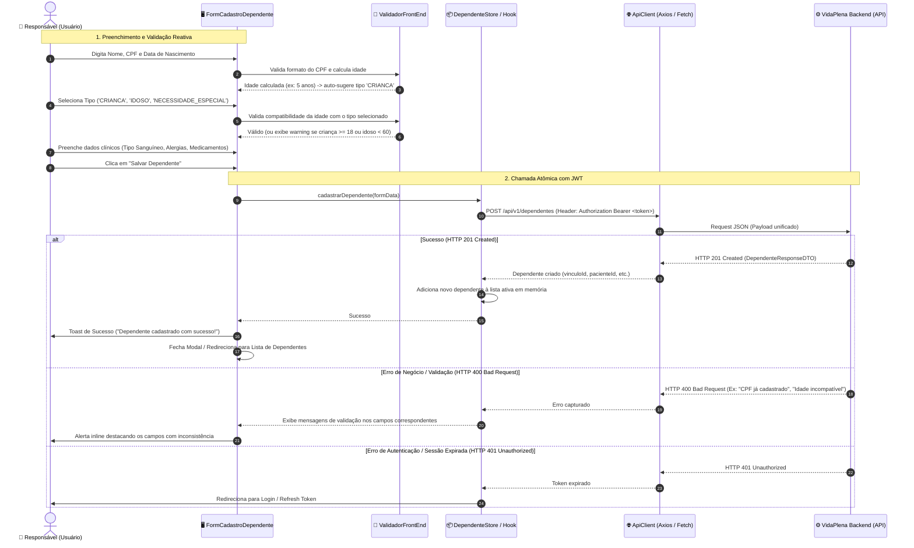
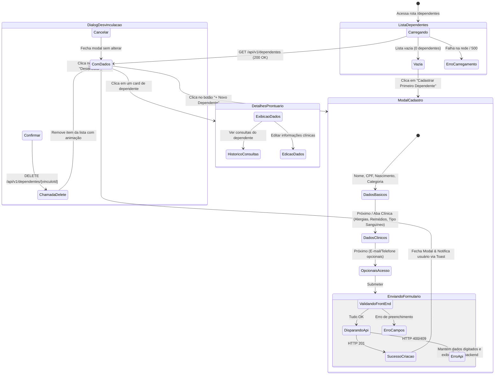
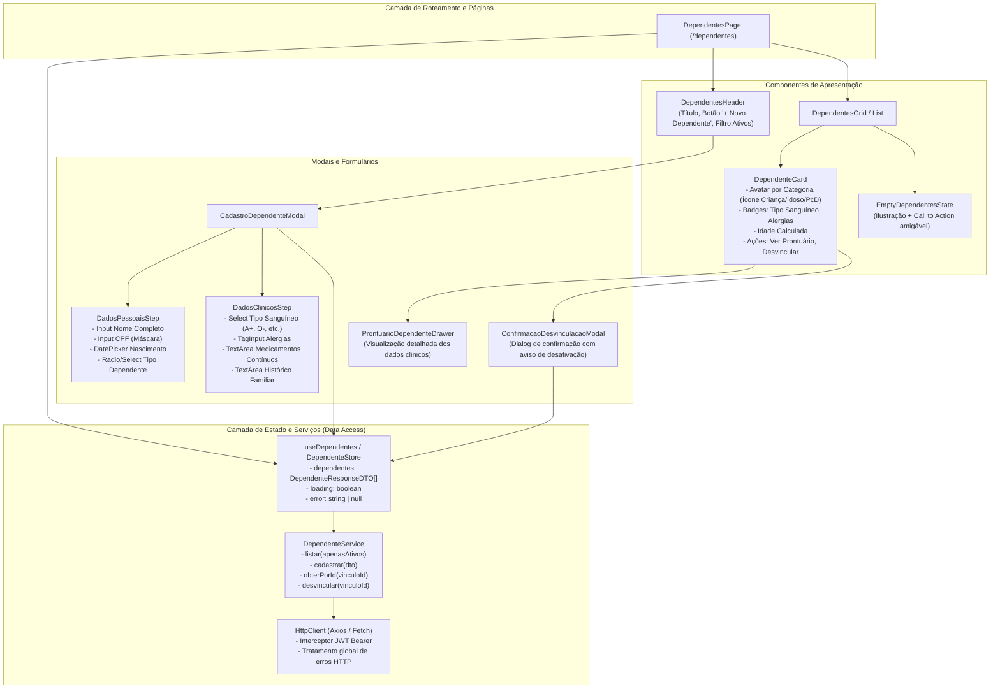

# 📐 Cadastro e Gerenciamento de Dependentes

Este documento detalha os diagramas de arquitetura, fluxo de telas, sequência de integração relacionados a implementação da funcionalidade de **Cadastro e Gerenciamento de Dependentes** conectada à **VidaPlena API**.

---

## 1. Diagrama de Sequência (Integração Front-end ↔ Back-end)

Demonstra a jornada desde o preenchimento do formulário, validações em tempo de digitação, disparo da requisição HTTP com token JWT, até o feedback visual e atualização de estado reativo.

---

## 2. Diagrama de Fluxo de Navegação e Estados (User Flow & State Machine)

Ilustra os caminhos do usuário entre a listagem de dependentes, abertura do formulário, visualização de prontuário e confirmação de desvinculação.

---

## 3. Diagrama de Arquitetura de Componentes Front-End

Sugestão de decomposição modular de componentes reutilizáveis para frameworks modernos (React, Vue, Angular ou Flutter):

---

## 4. Mapeamento de Campos e Regras de Validação de Interface

| Campo | Componente UI Recomendado | Obrigatoriedade | Regra de Validação / Comportamento no Front-End |
| :--- | :--- | :---: | :--- |
| **`nome`** | `Input (text)` | **Obrigatório** | Min. 2 caracteres, trim de espaços duplos. |
| **`cpf`** | `Input (text)` com máscara | **Obrigatório** | Máscara `999.999.999-99`. Validação de algoritmo dos dígitos verificadores antes do submit. |
| **`dataNascimento`** | `DatePicker` | **Obrigatório** | Data passada (não permite datas futuras). Dispara cálculo imediato de idade na UI. |
| **`tipo`** | `RadioGroup` / `Select` | **Obrigatório** | Opções: `CRIANCA`, `IDOSO`, `NECESSIDADE_ESPECIAL`. Sugerir automaticamente com base na idade:  • `< 18` $\rightarrow$ `CRIANCA` • `$\ge 60$` $\rightarrow$ `IDOSO`. |
| **`tipoSanguineo`** | `Select` | *Opcional* | Opções: `A+`, `A-`, `B+`, `B-`, `AB+`, `AB-`, `O+`, `O-`. |
| **`alergias`** | `TagInput` ou `TextArea` | *Opcional* | Permite registrar substâncias/alimentos separados por vírgula. Ex: *"Dipirona, Glúten"*. |
| **`medicamentosContinuos`** | `TextArea` | *Opcional* | Descrição de remédios de rotina e dosagens. |
| **`historicoFamiliar`** | `TextArea` | *Opcional* | Informações relevantes (ex: *"Diabetes tipo 2 na família"*). |
| **`email`** e **`senha`** | `Accordion` colapsado | *Opcional* | **Ocultar por padrão**. Se for um bebê ou idoso, o back-end gera credencial técnica de forma transparente. |

---
