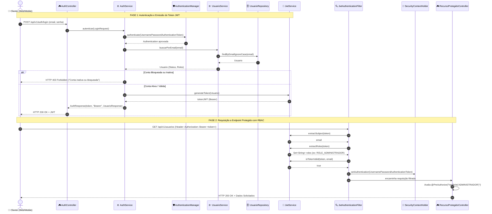
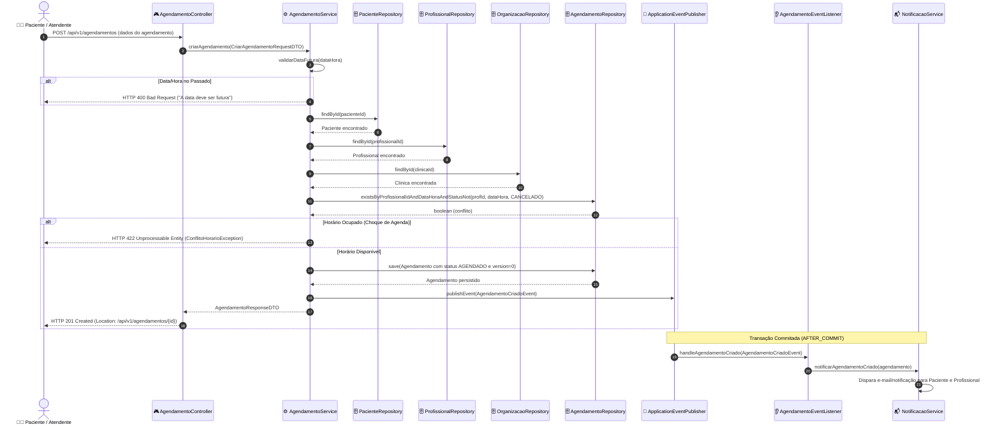
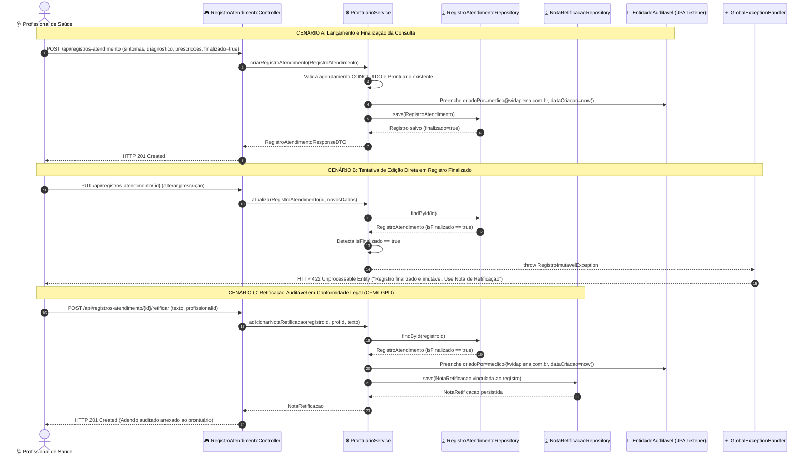
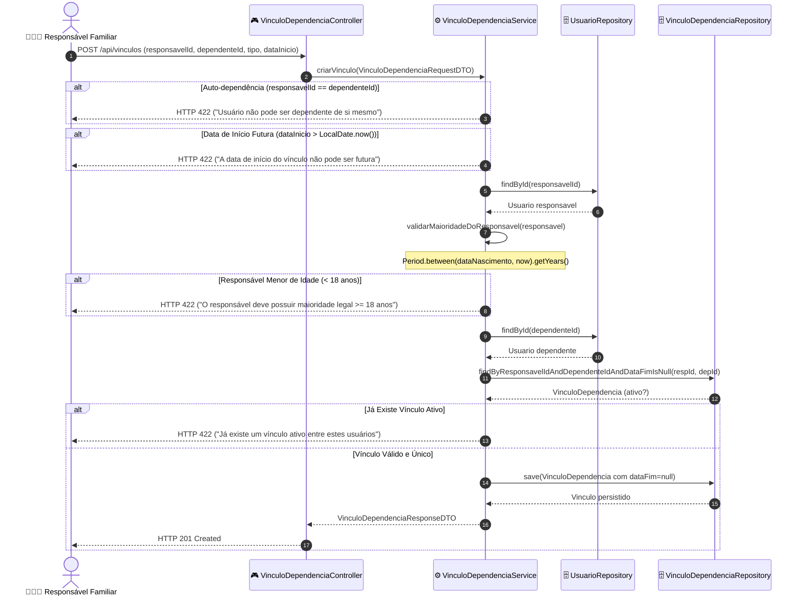
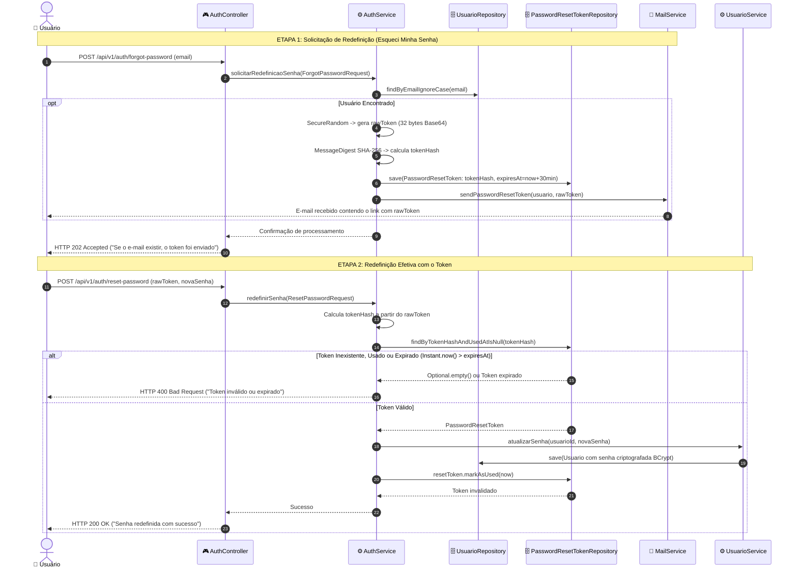
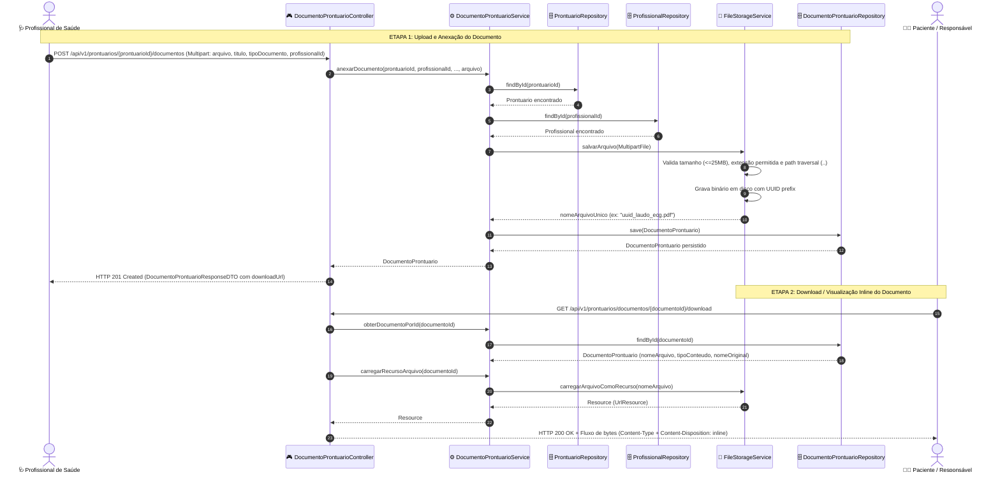

# 🔄 Diagramas de Sequência - Fluxos Críticos do VidaPlena Backend

Este documento apresenta os **Diagramas de Sequência UML** dos fluxos críticos de negócio, segurança e integridade de dados da **VidaPlena API**, modelados a partir da análise da implementação técnica.

---

## 1. Fluxo Crítico 1: Autenticação Stateless (Login JWT e Autorização RBAC)

Este fluxo descreve o ciclo de obtenção do token JWT e o posterior processamento de uma requisição autenticada protegida por controle de acesso baseado em papéis (RBAC).

---

## 2. Fluxo Crítico 2: Criação de Agendamento Clínico com Concorrência e Notificação por Eventos

Este fluxo detalha a validação de datas, verificação de choque de horário na agenda do profissional, persistência com controle de concorrência (*Optimistic Locking* via `@Version`) e publicação desacoplada de eventos de domínio.

---

## 3. Fluxo Crítico 3: Ciclo de Vida do Prontuário, Imutabilidade e Nota de Retificação

Este fluxo modela o atendimento médico: criação da evolução clínica, bloqueio de modificações diretas após finalização (*Legal Immutability*) e o mecanismo auditável de retificação (*Append-Only*).

---

## 4. Fluxo Crítico 4: Estabelecer Vínculo de Dependência com Validação de Maioridade

Este fluxo demonstra a aplicação de regras estritas do domínio familiar: bloqueio de auto-dependência, validação de maioridade civil ($\ge 18$ anos) através da data de nascimento e garantia de unicidade de vínculos ativos.

---

## 5. Fluxo Crítico 5: Recuperação Criptográfica Segura de Senha (Hash + TTL)

Este fluxo demonstra o protocolo de segurança para redefinição de senhas esquecidas: geração de token pseudo-aleatório seguro, armazenamento exclusivo do hash SHA-256 e expiração temporizada (TTL de 30 minutos).

---

## 6. Fluxo Crítico 6: Anexo de Documentos, Laudos e Imagens ao Prontuário

Este fluxo descreve a anexação segura de arquivos e exames (laudos, PDFs, imagens, exames laboratoriais) ao prontuário do paciente por profissionais autorizados, com validação de formato/tamanho, sanitização contra *path traversal* e streaming de download.

---

## 7. Resumo das Decisões de Arquitetura e Engenharia

| Fluxo | Mecanismo Central | Justificativa Técnica / Compliance |
| :--- | :--- | :--- |
| **Autenticação & RBAC** | Stateless JWT + Security Filter Chain | Escalabilidade horizontal, sem persistência de sessão em memória, autorização granular via `@PreAuthorize`. |
| **Agendamentos** | Prevenção de conflito + Optimistic Locking (`@Version`) + Spring Events | Evita *race conditions* em marcação simultânea; desacopla envio de e-mails/notificações da transação principal. |
| **Prontuário & Atendimento** | Bloqueio de mutação (`isFinalizado()`) + Notas de Retificação | Conformidade com as resoluções do CFM (Conselho Federal de Medicina) e LGPD para integridade do histórico médico. |
| **Documentos & Laudos** | Armazenamento seguro de arquivos + UUID prefix + Validação MIME/extensão | Previne *path traversal* (`..`), bloqueia executáveis maliciosos e permite anexação e streaming de exames laboratoriais e de imagem. |
| **Vínculos Familiares** | Validação de maioridade ($\ge 18$ anos) + Unicidade de vínculo ativo | Garante validade jurídica de tutela e responsabilidade sobre dependentes vulneráveis (crianças, idosos). |
| **Recuperação de Senha** | Token Hashing (SHA-256) + Expiração TTL (30 min) + Timing Attack Mitigation | Mesmo se o banco for comprometido, tokens não podem ser utilizados diretamente; resposta opaca HTTP 202 impede enumeração de e-mails. |
